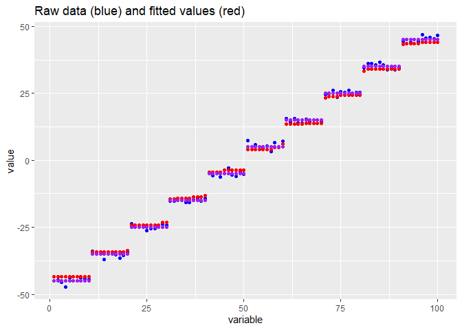

<!-- README.md is generated from README.Rmd. Please edit that file -->

# `wflsa`: Weighted Fused LASSO Signal Approximator

The **wflsa** R package provides an efficient implementation of an
algorithm for solving the Weighted Fused LASSO Signal Approximator
problem. This algorithm is based on an ADMM (Alternating Direction
Method of Multipliers) approach and is designed to estimate a vector of
coefficients with sparsity and smoothness constraints.

## Installation

You can install the package from GitHub using `pak`:

``` r
# install.packages("pak")
pak::pak("bips-hb/wflsa")
```

## Problem Formulation

The problem solved by the wFLSA algorithm is formulated as follows:

")

Where:

-  is the response
  variable with mean 0.
-  is the
  vector of coefficients to be estimated.
- 
  and
  
  are the - and
  -norms,
  respectively.
- 
  is the regularization parameter controlling the strength of the
  sparsity penalty.
- 
  is the regularization parameter controlling the smoothness.
- ![w\_{ij} \in \[0,1\]](https://latex.codecogs.com/png.latex?w_%7Bij%7D%20%5Cin%20%5B0%2C1%5D "w_{ij} \in [0,1]")
  is the weight between the
  -th and
  -th coefficient.

## Example Use

A simple example:

``` r
library(wflsa)

set.seed(1)

# number of covariates
p <- 10

# the response vector
y <- rnorm(p)

# Fully connected (Weight matrix is 1)
W <- matrix(rep(1, p*p), ncol = p) - diag(p)

# lambda values:
lambda1 <- c(0.01, 0.1, 0.2)
lambda2 <- c(0.01, 0.1, 0.2)

# Solve the weighted Fused LASSO Signal Approximator
wflsa(y, W, lambda1, lambda2)
#> Weighted Fused LASSO Signal Approximator
#> 
#> Number of variables (p) : 10
#> Number of lambda pairs  : 9
#> 
#> Estimated beta coefficients 
#> (0.01, 0.01):    -0.70   0.05    -0.87   1.36    0.18    -0.87   0.32    0.53    ...
#> (0.10, 0.01):    -0.61   0.00    -0.78   1.27    0.09    -0.78   0.23    0.44    ...
#> (0.20, 0.01):    -0.51   0.00    -0.68   1.17    0.00    -0.68   0.13    0.34    ...
#> (0.01, 0.10):    -0.18   0.02    -0.18   0.55    0.02    -0.18   0.02    0.02    ...
#> (0.10, 0.10):    -0.09   0.00    -0.09   0.46    0.00    -0.09   0.00    0.00    ...
#> ...
#> 
#> Number of non-zero coefficients:
#> 10 9 8 10 5 1 0 0 0
```

A more involved exaples:

``` r
library(flsa)
library(ggplot2)

# number of parameters. NOTE: is fixed here
p <- 100

# the average
mu <- as.vector(sapply(1:10 * 10, function(mu) rep(mu, 10)))
mu <- mu - mean(mu)

# generating the data
y <- rnorm(100, mean = mu)

# band_matrix function creates a square matrix with a band around the diagonal.
# Parameters:
#   - p: Size of the square matrix.
# Usage: band_matrix(p)
# Default band width is set to 1, but it can be adjusted as needed.

band_matrix <- function(p) {
  band_width <- 1  # Adjust the band width as needed
  
  # Create a matrix with a band around the diagonal
  my_matrix <- matrix(0, nrow = p, ncol = p)
  for (i in 1:p) {
    lower <- max(1, i - band_width)
    upper <- min(p, i + band_width)
    my_matrix[i, lower:upper] <- 1
    
  }
  diag(my_matrix) <- 0  # Set diagonal elements to 0 (optional, as they are already 1)
  my_matrix
}

# creating the weight matrix commonly used for the 1-dimensional fused lasso signal approximator
W <- band_matrix(p)

fit <- wflsa(y, W, lambda1 = 1, lambda2 = 4)
fit_flsa <- as.vector(flsa(y, lambda1 = .1, lambda2 = 2))

data <- data.frame(
  index = 1:p, 
  mu = mu,
  y = y, 
  beta_fit = fit$betas[[1]], 
  beta_fit_flsa = fit_flsa
)

ggplot2::ggplot(data) + 
  geom_point(mapping = aes(index, y), color = 'blue') + 
  geom_point(mapping = aes(index, beta_fit), color = 'red') + 
  geom_point(mapping = aes(index, mu), color = 'purple') + 
  ylab("value") + 
  xlab("variable") + 
  ggtitle("Raw data (blue) and fitted values (red)")
```



## Reference

*Louis Dijkstra, Moritz Hanke, Niklas Koenen, Ronja Foraita* (2024)\
**An Alternating Direction Method of Multipliers Algorithm for the Weighted Fused LASSO Signal Approximator**
[https://arxiv.org/abs/2407.18077](https://arxiv.org/abs/2407.18077)

## Acknowledgement

DFG - Deutsche Forschungsgemeinschaft (FO 1045/2-1)

## Author

Louis Dijkstra

## Contact

Ronja Foraita\
Leibniz Institute for Prevention Research & Epidemiology\
E-mail: R (at) leibniz-bips.de
